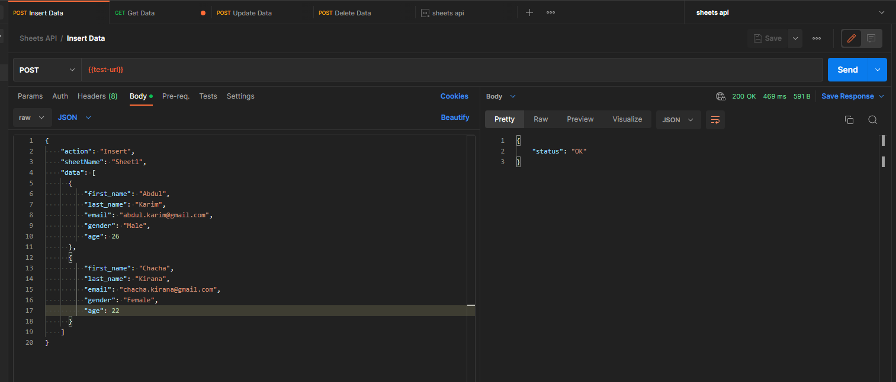
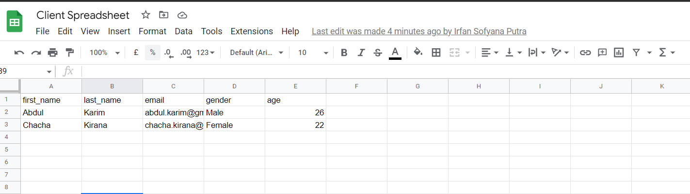
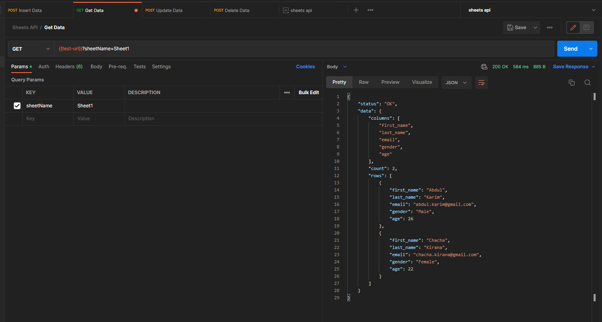
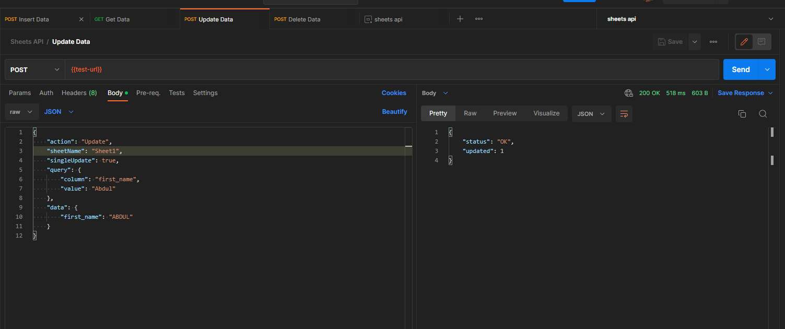
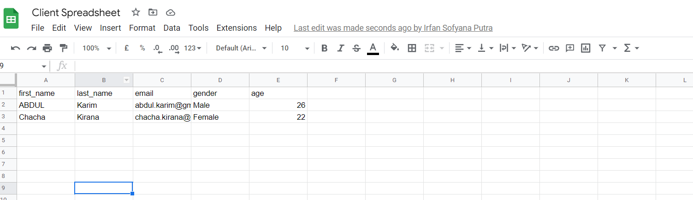
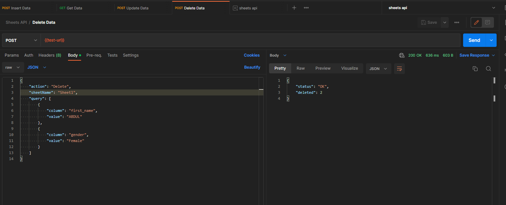
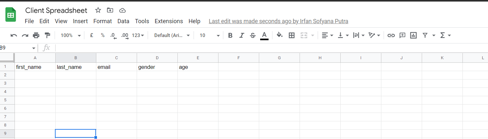

# sheets-api
Make your Google Sheets into JSON API with free and easy!

## Table of Contents

- [What is it?](#what-is-it)
- [Installation](#instalation)
- [APIs](#list-of-apis)
    - [Insert API](#insert-data)
        - [Request Body](#request-body)
        - [Response Body](#response-body)
        - [Example Request](#example-request)
        - [Example Response](#example-response)
    - [Read API](#read-data)
        - [Query Parameters](#query-parameters)
        - [Response Body](#response-body-1)
        - [Example Request](#example-request-1)
        - [Example Response](#example-response-1)
    - [Update API](#update-data)
        - [Request Body](#request-body-1)
        - [Response Body](#response-body-2)
        - [Example Request](#example-request-2)
        - [Example Response](#example-response-2)
    - [Delete API](#delete-data)
        - [Request Body](#request-body-2)
        - [Response Body](#response-body-3)
        - [Example Request](#example-request-3)
        - [Example Response](#example-response-3)
    - [Error Response](#error-response)
- [Limitations](#limitations)
- [Roadmaps](#roadmaps)
- [Demo](#demo)

## What is it?

sheets-api is basically a Google App Script library which can be used to make your Google Sheets into a JSON API. It has set of APIs that you can use to search, add, update, and delete from Google Sheets data.

This library is a good, easy to use, and free alternatives for some paid products like [SheetDB](https://docs.sheetdb.io/), [Sheetsu](https://sheetsu.com/) and others.

## Instalation

To install this library, you can create any Google Sheets and add an appscript to it. Once the sheet has been created, you are require to import following AppScript library `1CXhFa7xZxSYpUDyVUP7rL4ADup2DFDpxs-6vUxFqiTmNRFVNBd2O0GIx` and make the identifier for this library as `Gsheetsapi`. This identifier can be changed but make sure you're updated on the code below as well. You can use the latest version available of this library.

Once it's imported successfully, copy following appscript code and paste it to your appscript file.

```javascript
const sheetID = SpreadsheetApp.getActiveSpreadsheet().getId()

function doPost(req) {
  return Gsheetsapi.doPostHandler(sheetID, req);
}

function doGet(req) {
  return Gsheetsapi.doGetHandler(sheetID, req);
}
```

After writing the above code, we need to deploy our app script as a web APP by going to the Deploy menu > Manage Deployments > Create Deployment. Since this is the first deployment, you will be required to select the deployment type; in this case, you should choose Web App.

Once you have chosen your Web App, you must set the "Who has access" section. To ensure that the API is accessible to everyone without complex authorization, select "Anyone". Please keep note that although your webapp is accessible by anyone, your spreadsheet itself is still protected. **This library also has a roadmap plan to enhance security using an API key mechanism; although anyone can access it, only those with the API key will be able to view the data**.

After you click "Deploy", you will need to grant the appscript code access to your spreadsheet. To do this, simply follow the given steps and make sure to select the correct Google account. Once access is given, you'll be able to view the Web URL in the format https://script.google.com/macros/s/xxxxxxx/exec. This URL serves as the base URL for making API calls.

## List of APIs

### Insert Data

This API is used to insert data to a certain sheet name.

| Method | URL |
| ------ | --- |
| POST   | {{appscript_web_url}}

#### Request Body

| Parameter | Type | Required | Description |
| --------- | ---- | -------- | ----------- |
| action | string | mandatory | Must be set to "Insert" with case insensitive |
| sheetName | string | mandatory   | Sheet name where the data will be inserted |
| data      | array | mandatory  | Array of objects which will be inserted to the sheet. The keys of the object are the columns in the sheet and the value of the objects are the value that will be inserted |

#### Response Body

| Parameter | Type | Description |
| --------- | ----  | ----------- |
| status    | string | Status of the response. It will be set to "OK" if the request is success |

#### Example Request:

```bash
curl --location 'https://script.google.com/macros/s/AKbcvfxUQKPcQokx8D_OcFC04FO1r36SJfWKKHayGOgEZ2DhYI26u10rdg51hRHTv5oUgAQabc/exec' \
--header 'Content-Type: application/json' \
--data '{
    "actionn": "Insert",
    "sheetName": "Sheet 1",
    "data": [
        {
            "first_name": "Irfan",
            "last_name": "Putra",
            "age": 23,
            "nationality": "Indonesia"
        }
    ]
}'
```

#### Example Response:

```JSON
{
    "status": "OK"
}
```

### Read Data

This API is used to read data from Google sheets.

| Method | URL |
| ------ | --- |
| GET    | {{appscript_web_url}}

#### Query Parameters


| Parameter | Type | Required | Description |
| --------- | ---- | -------- | ----------- |
| sheetName | string | required | Sheet name where the data will be read |
| action | string | optional | Can be set to "search" if you need to search specific data |
| limit | integer | optional | Limit the number of rows returned. If set, must be value > 0 |
| offset | integer | optional | How many rows to skip. If set, must be value > 0 | 

#### Response Body

| Parameter | Type | Description |
| --------- | ----  | ----------- |
| status    | string | Status of the response. It will be set to "OK" if the request is success |
| data   | object | Object that contains the data information |
| data.columns | array of string | Columns that are exist on the given sheet name
| data.count | integer | The number of rows returned |
| data.rows | object | The rows data returned |


#### Example Request

```bash
curl --location 'https://script.google.com/macros/s/AKbcvfxUQKPcQokx8D_OcFC04FO1r36SJfWKKHayGOgEZ2DhYI26u10rdg51hRHTv5oUgAQabc/exec?sheetName=Sheet%201'
```

#### Example Response

```json
{
    "status": "OK",
    "data": {
        "columns": [
            "first_name",
            "last_name",
            "age",
            "nationality",
        ],
        "count": 2,
        "rows": [
            {
                "first_name": "irfan",
                "last_name": "Putra",
                "age": 23,
                "nationality": "Indonesia"
            },
            {
                "first_name": "Neymar",
                "last_name": "Junior",
                "age": 31,
                "nationality": "Brazil"
            }
        ]
    }
}
```

### Update Data

This API is used to update some rows data from a certain sheet name.

| Method | URL |
| ------ | --- |
| POST   | {{appscript_web_url}}


#### Request Body

| Parameter | Type | Required | Description |
| --------- | ---- | -------- | ----------- |
| action | string | mandatory | Must be set to "Update" with case insensitive |
| sheetName | string | mandatory   | Sheet name where the data will be updated |
| singleUpdate | boolean | mandatory | The update operation mode whether it's single update or batch update. Set to `true` if it's single update otherwise it's batch update |
| query | object | conditional | Query to match for the rows that will be updated. Consist of `column` and `value` keys. `column` key is the column name and `value` is the value of the column that will be query. This field is mandatory if `singleUpdate` is true. |
| data | object | conditional | All rows match `query` before will be updated with this data. This field is mandatory if `singleUpdate` is true  |

#### Response Body

| Parameter | Type | Description |
| --------- | ----  | ----------- |
| status    | string | Status of the response. It will be set to "OK" if the request is success |
| updated   | integer | The number of rows that are updated |  

#### Example Request:

```bash
curl --location 'https://script.google.com/macros/s/AKbcvfxUQKPcQokx8D_OcFC04FO1r36SJfWKKHayGOgEZ2DhYI26u10rdg51hRHTv5oUgAQabc/exec' \
--header 'Content-Type: application/json' \
--data '{
    "action": "Update",
    "sheetName": "Sheet 1",
    "singleUpdate": true,
    "query": {
        "column": "first_name",
        "value": "irfan"
    },
    "data": {
        "first_name": "IRFAN",
        "last_name": "PUTRA",
        "age": 25
    }
}'
```

#### Example Response:

```JSON
{
    "status": "OK",
    "updated": 1,
}
```

### Delete Data

This API is used to delete some rows data from a certain sheet name that match any query given.

| Method | URL |
| ------ | --- |
| POST   | {{appscript_web_url}}

#### Request Body

| Parameter | Type | Required | Description |
| --------- | ---- | -------- | ----------- |
| action | string | mandatory | Must be set to "Delete" with case insensitive |
| sheetName | string | mandatory   | Sheet name where the data will be deleted |
| query | array of object | mandatory | Array of query to match for the rows that will be deleted. Consist of `column` and `value` keys. `column` key is the column name and `value` is the value of the column that will be query. |

#### Response Body

| Parameter | Type | Description |
| --------- | ----  | ----------- |
| status    | string | Status of the response. It will be set to "OK" if the request is success |
| deleted   | integer | The number of rows that are deleted |  

#### Example Request:

```bash
curl --location 'https://script.google.com/macros/s/AKbcvfxUQKPcQokx8D_OcFC04FO1r36SJfWKKHayGOgEZ2DhYI26u10rdg51hRHTv5oUgAQabc/exec' \
--header 'Content-Type: application/json' \
--data '{
    "action": "Delete",
    "sheetName": "Sheet 1",
    "query": [
        {
            "column": "first_name",
            "value": "irfan"
        }
    ]
}'
```

#### Example Response:

```JSON
{
    "status": "OK",
    "deleted": 1,
}
```

### Error Response

The API has following structure for error response

| Parameter | Type | Description |
| --------- | ---- | ----------- |
| error_code | string | This is error code in the high level. The values are `BAD_REQUEST`, `UNAUTHORIZED`, `SERVER_ERROR` |
| error_message | string | The description on why the error is exist |

## Limitations

Below are some existing limitations:
- API is not giving the proper HTTP status in response header due to technical limitation on AppScript. For error handling on the client side, user need to check it from the response body.

## Roadmaps

This library is still an MVP and will continue to develop as time goes by. Here are things that already in plan:

- Optimizing Delete API which seems to be slow at the moment
- Better security mechanism using API key to limit access of the API
- Implement Bulk Update API
- Implement more features on read/search data

## Demo

Here are some demo when using this library with the existing APIs with the help of Postman.

### Add Data Demo



### Read Data Demo


### Update Data Demo





### Delete Data Demo



